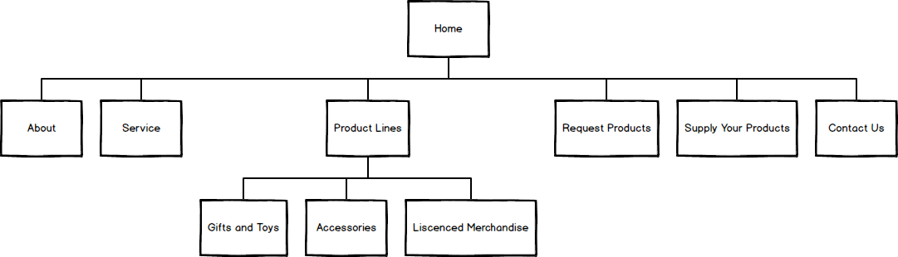

# Site Specification

* HTML5
* CSS3
* Bootstrap
* JS
* JQuery

# Gives examples of:

* Effective use of the Boostrap library
* Mobile first design
* UX
* JQuery Events and Effects
* Ajax
* Wireframing and Mockups

# General Description

Chomp is an online distributor of gaming related merchandise, accessories and toys.

Is supplies a wide variety of stock to UK retailers and online stores.

# Target Audience

The primary audience are retailers and shops which sell video game and technology related to gaming, such as GAME.

The aim is to provide them with stock which can be sold as part of their toys and accessory lines. These range from liscenced novelty items to unique appliances for games consoles.

The secondary audience are manufacturers and companies with related products in stock, and are looking to have their products stored and distributed by us.

The third audience is the customer themselves, who will typically be in the 14 - 30 male demographic, who have an active interest in video games.

The aim is to provide them with interesting and well made products. 

# Strategy

* Make money from distributing merchandise.
* Be a cost-competitive force in the industry.
* Offer quality products with unique and interesting qualities.
* Store and deliver this stock.
* Increase the amount of retailers and manufactuters using the service.
* Have a request program to allow distrubutors to ask for shipping of additional items not currently on offer.

# Scope

* Read Content
* View Products
* Check Availability
* Fill in Contact Forms
* Find Contact Information
* Find Out More About Us

# Structure

